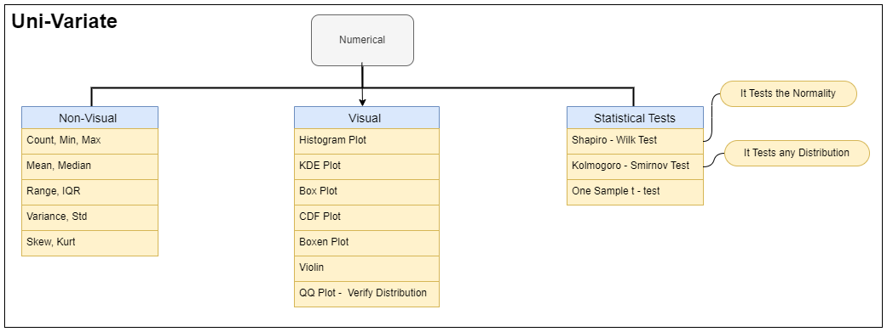
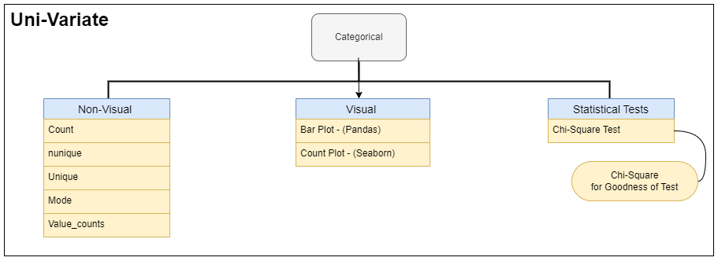
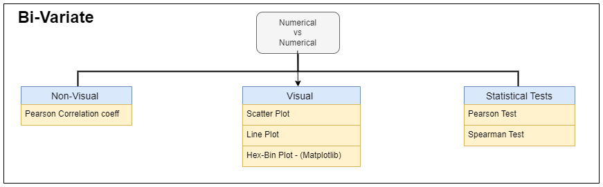
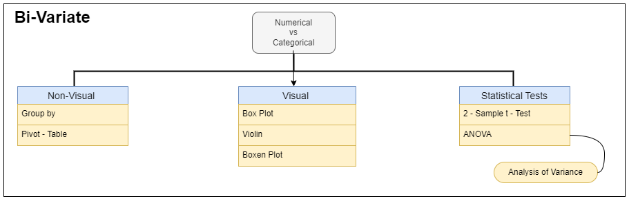
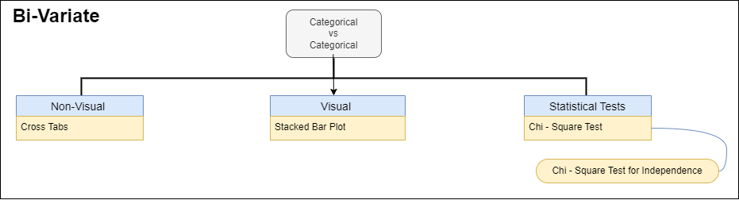

# Statistics-and-Data-Analysis

**Uni-variate**, **bi-variate**, and **multi-variate** analyses are statistical techniques used in data analysis to **understand relationships between variables**. They are not specific to AI but rather fall under the broader umbrella of statistics and data analysis. 

However, `they are often used in AI applications, particularly in machine learning and data science, to explore and understand datasets before building models or making predictions.` So, while they aren't a subset of AI per se, they are certainly tools commonly used within AI.

## What is a Statistical Test?
Statistical tests are used in Hypothesis Testing. You can use them to determine:

1. the relationships between input and output variables
1. estimate the differences between two or more groups

## What is Hypothesis Testing?
Hypothesis testing is a way for data scientists and researchers to make decisions about whether their ideas, or hypotheses, are supported by evidence from their experiments or observations.

Here's a simple breakdown:

1. **Formulate a Hypothesis**: Start with an idea or a guess about something you want to study. This is called a hypothesis.
1. **Collect Data**: Conduct experiments or gather information to see if the data supports your hypothesis.
1. **Test Your Hypothesis**: Use statistical techniques to analyze the data and determine if it provides strong evidence for or against your hypothesis.
1. **Decide a Significance Level**: Decide a significance level.
1. **Make a Conclusion**: Based on the analysis, you decide whether the data supports your original idea or if it suggests something different.

# Example 1: Hypothesis Testing for new drug

## Overview

Hypothesis testing is a fundamental concept in statistics and scientific research. It allows researchers to make decisions based on evidence gathered from experiments or observations. Here's an example to illustrate how hypothesis testing works:

## Example Scenario

Imagine a pharmaceutical company develops a new drug to treat a certain medical condition. The researchers hypothesize that patients who take the new drug will experience a reduction in symptoms compared to those who do not take the drug.

1. **Formulate a Hypothesis:** The hypothesis is that the new drug will reduce symptoms in patients with the medical condition.

2. **Collect Data:** The researchers conduct a clinical trial where they randomly assign patients to two groups: one group receives the new drug (the experimental group), and the other group receives a placebo (the control group). They collect data on the symptoms experienced by each group over a specified period.

3. **Test Your Hypothesis:** The researchers use statistical techniques to analyze the data and determine if there is a significant difference in symptom reduction between the two groups. They may use methods such as **t-tests** or **ANOVA** to compare means or **chi-square tests** to compare proportions.

4. **Decide a Significance Level:** The researchers decide on a significance level, typically denoted as alpha (α), which represents the threshold for determining whether the results are statistically significant. Common significance levels include 0.05 or 0.01.

5. **Make a Conclusion:** Based on the analysis, the researchers conclude whether the data provide strong evidence to support the hypothesis that the new drug reduces symptoms compared to the placebo. If the results are statistically significant at the chosen significance level, they may accept the hypothesis. If not, they may reject it or modify it based on the evidence.

## Conclusion

Hypothesis testing is a powerful tool that allows researchers to draw conclusions based on empirical evidence. By following a systematic process, researchers can evaluate their hypotheses and make informed decisions in various fields of study.

# Example 2: Hypothesis Testing in Market Research

## Overview

Hypothesis testing is a statistical method used in market research to make data-driven decisions about marketing strategies, product launches, or consumer behavior. Let's consider an example:

## Example Scenario

A company is launching a new product, and they want to determine if a particular marketing campaign will lead to a higher sales conversion rate compared to their previous campaign.

1. **Formulate a Hypothesis:** The hypothesis is that the new marketing campaign will result in a higher sales conversion rate than the previous campaign.

2. **Collect Data:** The company runs both the new and old marketing campaigns simultaneously in different markets or segments. They track the number of people exposed to each campaign and the resulting sales conversions.

3. **Test Your Hypothesis:** Using statistical techniques, such as hypothesis testing for proportions, the company compares the sales conversion rates between the two campaigns. They calculate p-values and confidence intervals to determine if there is a statistically significant difference in conversion rates.

4. **Decide a Significance Level:** The company decides on a significance level, such as 0.05, to determine the threshold for statistical significance.

5. **Make a Conclusion:** Based on the analysis, the company determines whether the data provide sufficient evidence to support the hypothesis that the new marketing campaign leads to a higher sales conversion rate. If the results are statistically significant at the chosen significance level, they may conclude that the new campaign is effective. If not, they may need to reevaluate their marketing strategy or conduct further research.

## Conclusion

Hypothesis testing enables companies to make informed decisions about marketing strategies and product launches by analyzing empirical data. By rigorously testing hypotheses, companies can optimize their marketing efforts and improve business outcomes.

# Example 3: Hypothesis Testing: Detective Analogy

## Overview

Hypothesis testing is akin to being a detective and using clues to decide if a suspect is guilty or not guilty. Let's explore this analogy further:

## Example Scenario

Imagine a detective investigating a crime where a suspect, Mr. X, is accused of theft. The detective needs to gather evidence to determine if Mr. X is guilty or innocent.

1. **Formulate a Hypothesis:** The hypothesis is that Mr. X is guilty of the theft.

2. **Collect Evidence:** The detective gathers evidence such as fingerprints, eyewitness testimonies, and security camera footage from the crime scene.

3. **Test Your Hypothesis:** Using the collected evidence, the detective conducts hypothesis testing to evaluate the likelihood that Mr. X is guilty. Each piece of evidence serves as a clue in the investigation. For example, fingerprints matching Mr. X's could support the hypothesis, while an alibi or contradictory testimony could cast doubt on it.

4. **Decide a Significance Level:** The detective sets a significance level, analogous to the threshold of reasonable doubt in a legal case. If the evidence meets this threshold, the hypothesis (guilt) is supported.

5. **Make a Conclusion:** Based on the analysis of the evidence, the detective decides whether there is sufficient proof to support the hypothesis of Mr. X's guilt. If the evidence is compelling and meets the significance level, the detective may conclude that Mr. X is guilty. If not, Mr. X is presumed innocent until proven otherwise.

## Conclusion

Hypothesis testing, like detective work, involves gathering and analyzing evidence to make informed decisions. By systematically evaluating hypotheses and considering the strength of the evidence, detectives (and researchers) can draw conclusions that are supported by empirical data.

# What is a Type I and Type II Error?
Type I and Type II errors are concepts related to hypothesis testing in statistics. Here's an explanation of each type with examples:

## Type I Error (False Positive):
**Definition**: Type I error occurs when we reject a true null hypothesis. In other words, we incorrectly conclude that there is an effect or difference when there isn't one.

**Symbol**: Often denoted by (α), the significance level.

**Example**:
   * Scenario: Testing a new drug's effectiveness.
   * Null Hypothesis(H0) : The drug has no effect.
   * Type I Error(α) : Concluding the drug is effective when it actually has no effect. or Concluding the person has commited a crime when he is actually innocent.

## Type II Error (False Negative):
**Definition**: Type II error occurs when we fail to reject a false null hypothesis. In this case, there is a true effect or difference, but our test fails to detect it.

**Symbol**: Often denoted by (β).

**Example**:
   * **Scenario**: Testing a new drug's effectiveness.
   * **Alternative Hypothesis(H1):** The drug has a significant effect.
   * **Type II Error(β)** : Failing to detect the drug's effectiveness when it actually has an effect. or Failing to detect the person has commited a crime when he is actually guilty.

## Relationship:
**Inverse Relationship**: There is typically an inverse relationship between Type I and Type II errors. As you decrease the likelihood of one type of error, the likelihood of the other type of error increases.
**Adjusting Significance Level**: By decreasing the significance level, the probability of Type I error decreases, but the probability of Type II error may increase.

It's crucial to strike a balance between these two types of errors based on the specific context and consequences of each error. The choice of significance level and statistical power (the ability to detect true effects) influences the likelihood of Type I and Type II errors in hypothesis testing.

# Hypothesis Testing and Errors

## What is Hypothesis Testing?

Hypothesis testing is a way for data scientists and researchers to make decisions about whether their ideas, or hypotheses, are supported by evidence from their experiments or observations. Here's a simple breakdown:

1. **Formulate a Hypothesis:** Start with an idea or a guess about something you want to study. This is called a hypothesis.
2. **Collect Data:** Conduct experiments or gather information to see if the data supports your hypothesis.
3. **Test Your Hypothesis:** Use statistical techniques to analyze the data and determine if it provides strong evidence for or against your hypothesis.
4. **Decide a Significance Level:** Decide a significance level.
5. **Make a Conclusion:** Based on the analysis, you decide whether the data supports your original idea or if it suggests something different.

## Examples of Hypothesis Testing

### Example 1: Hypothesis Testing for New Drug

- **Null Hypothesis (H0):** The new drug does not reduce symptoms in patients with the medical condition.
- **Alternative Hypothesis (H1):** The new drug reduces symptoms in patients with the medical condition.

### Example 2: Hypothesis Testing in Market Research

- **Null Hypothesis (H0):** The new marketing campaign does not result in a higher sales conversion rate compared to the previous campaign.
- **Alternative Hypothesis (H1):** The new marketing campaign results in a higher sales conversion rate compared to the previous campaign.

### Example 3: Hypothesis Testing: Detective Analogy

- **Null Hypothesis (H0):** Mr. X is not guilty of the theft.
- **Alternative Hypothesis (H1):** Mr. X is guilty of the theft.

## Type I and Type II Error Explanation

- **Type I Error (False Positive):** This occurs when we incorrectly reject the null hypothesis when it is actually true.
- **Type II Error (False Negative):** This occurs when we fail to reject the null hypothesis when it is actually false.

# What is p-value?
The p-value, short for "probability value," is a number that helps us understand the strength of evidence against a null hypothesis in hypothesis testing.

or 

* p-value quantifies the strength of evidence i.e. how likely the evidence occured by a random chance. The smaller the p-value, less likely the result occured by random change and the stronger the evidence that you should reject the null hypothesis.

* To say whether the p-value is significant or not, we need a significance threshold called the significance level. This threshold is usually set at 0.05.

* It's important because it helps control the rate of Type I errors. By setting a threshold, we define the level of evidence needed to reject the null hypothesis. Lower thresholds (e.g., 0.01) require stronger evidence.

* If the p-value is BELOW the threshold (meaning smaller than), then you can infer a statistically significant evidence i.e. outcome didn't occur randomly.
i.e. For p-value < 0.05, you can Reject the Null Hypothesis

* Otherwise, then you can infer no statistically significant evidence i.e. outcome occured at random.
i.e. For p-value > 0.05, you Fail to Reject the Null Hypothesis

**Here's a simple explanation:**

#### 1. Formulate the Hypothesis
* Null Hypothesis (H0): This is a statement that there is no significant difference or relationship. It's like assuming innocence in a court trial.

* Alternative Hypothesis (H1): This is the opposite of the null hypothesis. It suggests that there is a significant difference or relationship.
#### 2. Collect Data: Perform experiments or gather information.
#### 3. Apply an appropriate Statistical Test
* **Calculate Test Statistic**: This is a numerical value calculated from your data, depending on the type of test you're conducting (e.g., t-test, F-test, etc.).
* **Calculate p-value**: It's the probability of observing a test statistic as extreme as, or more extreme than, the one calculated from your data, assuming the null hypothesis is true.
#### 4. Decide a Significance Level
#### 5. Make a Conclusion
* if p_value < significance_level => Reject the null hypothesis (H0)
* otherwise => Fail to reject the null hypothesis (H0)

**Now, let's go through an example:**
### Example: Coin Toss
Suppose you have a coin and you want to test if it's fair (i.e., has an equal chance of landing heads or tails). Here's how hypothesis testing works:

#### 1. Formulate the Hypothesis.
* **Null Hypothesis (H0):** The coin is fair.
* **Alternative Hypothesis (H1):** The coin is not fair (meaning it's biased).
#### 2. Collect a sample.
You flip the coin 100 times and get 60 heads and 40 tails.
#### 3. You calculate a test statistic
* In this case, you might use a chi-squared test.
* Let's say the p-value you calculate is 0.03.
#### 4. Decide a significance_level (i.e. alpha = 0.05)
#### 5. Make a conclusion - 
If you set a significance level (often denoted as alpha, α) at 0.05 (5%), then your p-value of 0.03 is less than α. This means:
* If the coin were fair (null hypothesis is true), you'd expect to see results as extreme as this or more extreme only 3% of the time.
* Since 3% is less than 5%, you have enough evidence to reject the null hypothesis. You conclude that the coin is likely biased.
Remember, a small p-value indicates strong evidence against the null hypothesis, while a large p-value suggests weak evidence against it. However, a p-value alone does not prove or disprove anything; it's just part of the evidence you consider in making a decision.

# Example: Hypothesis Testing with Exam Performance

In this example, we'll illustrate how hypothesis testing can be applied to examine the difference in exam performance between two groups of students.

### Formulate the Hypothesis:
- **Null Hypothesis (H0):** There is no significant difference in exam performance between two groups of students.
- **Alternative Hypothesis (H1):** There is a significant difference in exam performance between the two groups of students.

### Collect Data:
- You administer an exam to two groups of students: Group A and Group B.

### Apply an Appropriate Statistical Test:
- You decide to perform an independent samples t-test to compare the mean scores of the two groups.

### Calculate Test Statistic:
- After grading the exams, you find that Group A has a mean score of 75, with a standard deviation of 8, and Group B has a mean score of 80, with a standard deviation of 7.

### Calculate p-value:
- Using the t-test, you calculate a p-value of 0.02.

### Decide a Significance Level:
- Let's set a significance level (alpha) at 0.05.

### Make a Conclusion:
- If there were truly no difference in exam performance between the two groups (null hypothesis is true), you'd expect to see results as extreme as this or more extreme only 2% of the time.
- Since 2% is less than 5%, you have enough evidence to reject the null hypothesis.
- Therefore, you conclude that there is a significant difference in exam performance between Group A and Group B.

# Important Hypothesis Tests

There are many hypothesis tests used in statistical analysis. Below are several important ones, categorized into univariate and bivariate tests, and further divided based on the type of data they are suitable for:

## Univariate Tests

### Tests for Categorical Data

#### Chi-Square Goodness-of-Fit Test
- **Description:** Tests whether the observed frequencies of categorical data match the expected frequencies according to a specified distribution.
- **Use:** Often used to analyze categorical data and test for goodness of fit.

### Tests for Numerical Data

#### Shapiro-Wilk Test
- **Description:** A statistical test that checks whether a dataset follows a normal distribution.
- **Use:** Useful for assessing the normality of data before applying certain statistical tests.

#### Kolmogorov-Smirnov Test
- **Description:** Tests whether a sample comes from a specific distribution (not limited to normal distribution). It can be used to compare any two continuous distributions.
- **Use:** Often used to compare the distributions of two samples.

#### One-Sample t-test
- **Description:** Tests whether the mean of a single sample is significantly different from a known or hypothesized population mean.
- **Use:** Used to determine if there is a significant difference between a sample mean and a population mean.

#### Mann-Whitney U Test (Wilcoxon Rank-Sum Test)
- **Description:** Nonparametric test that compares the medians of two independent samples.
- **Use:** Used when assumptions of normality and equal variances are violated or when dealing with ordinal or non-normally distributed data.

## Bivariate Tests

### Tests for Categorical Data

#### Chi-Square Test of Independence
- **Description:** Tests whether there is a significant association between two categorical variables in a contingency table.
- **Use:** Used to determine if there is a relationship between two categorical variables.

#### Fisher's Exact Test
- **Description:** A statistical test used to determine if there are nonrandom associations between two categorical variables when sample sizes are small.
- **Use:** Particularly useful when dealing with small sample sizes in contingency tables.

#### McNemar's Test
- **Description:** A statistical test used to determine if there are changes in proportions between two related categorical variables measured at two different time points.
- **Use:** Commonly used in before-and-after studies or in studies with paired categorical data.

#### Chi-Square Test:
* The Chi-Square test is a statistical test used to determine if there is a significant association between two categorical variables.
In the context of feature selection, the Chi-Square test can be used to assess the independence between each feature and the target variable. Features that are highly dependent on the target variable are considered more important and can be selected for further analysis.
This test is particularly useful when dealing with categorical data or when the relationship between features and the target variable is not linear.

### Tests for Numerical Data

#### Pearson Test
- **Description:** Tests whether two samples have a linear relationship.
- **Use:** Commonly used to assess the correlation between two continuous variables.

#### Two-Sample t-test
- **Description:** Compares the means of two related samples (e.g., before and after treatment) to determine if there is a significant difference.
- **Use:** Used to compare the means of two groups and assess if they are statistically different.

#### ANOVA (Analysis of Variance)
- **Description:** Compares the means of three or more independent groups to determine if there are any statistically significant differences between them.
- **Use:** Useful for comparing means across multiple groups simultaneously.
- ANOVA (Analysis of Variance): 
   * ANOVA is a statistical test used to compare the means of two or more groups to determine if there are statistically significant differences between them.
In the context of feature selection, ANOVA can be used to assess the importance of individual features by analyzing the variance between different groups or categories in the target variable.
   * Features that result in a large variance between groups and a small variance within groups are considered more important and can be selected for further analysis.

